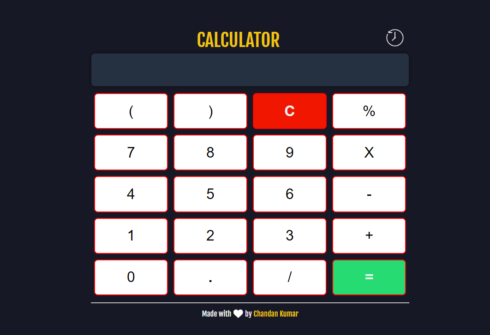

" A calculator is a device used to perform mathematical calculations. It can be a physical handheld device or a software application on a computer or smartphone. Calculators typically have a numeric keypad and various function buttons for addition, subtraction, multiplication, and division. They may also include advanced features like square roots, percentages, and memory functions. Calculators are widely used in education, finance, engineering, and everyday life for quick and accurate calculations. app."

To experince the app click this link :- https://javascriptcalculator14.netlify.app/

